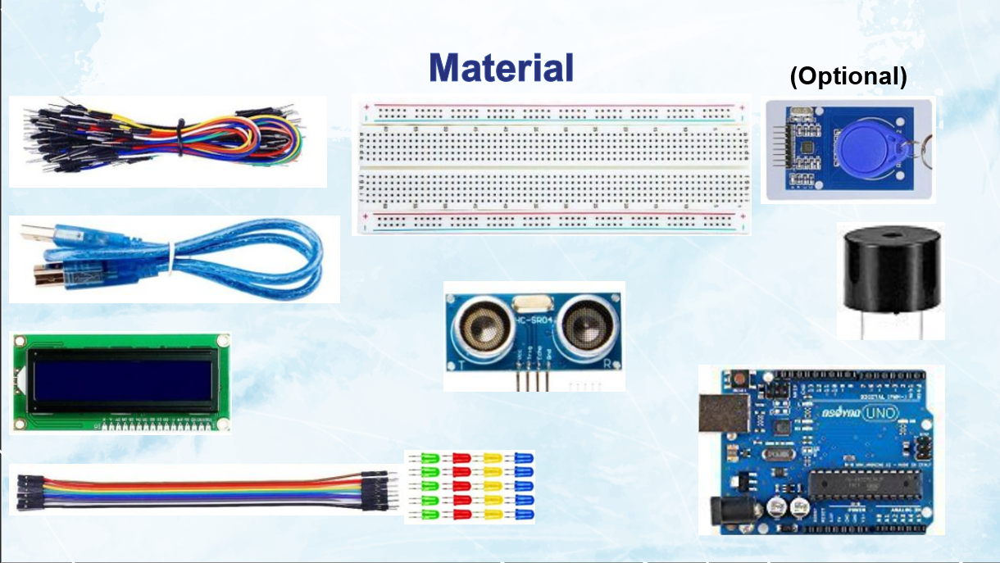
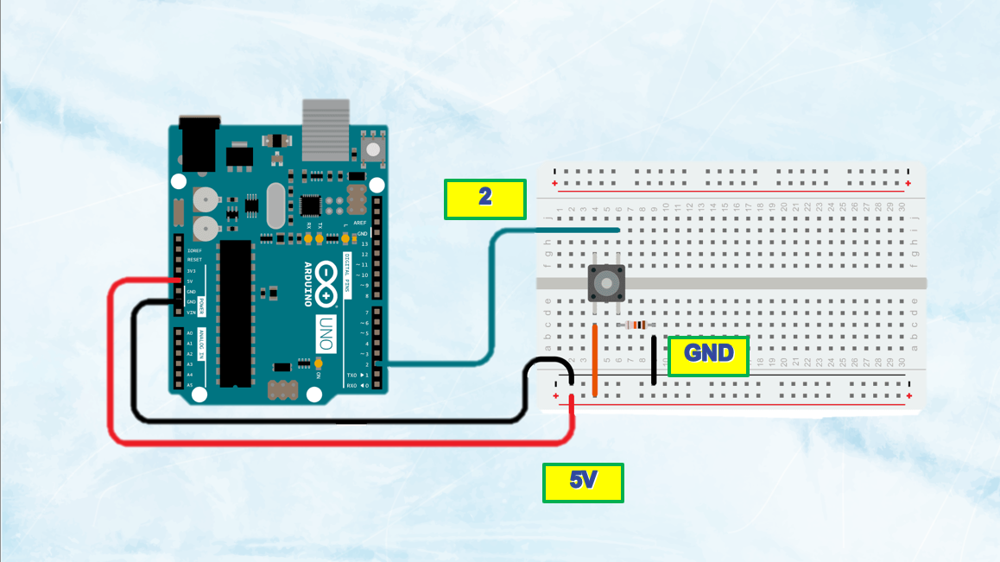
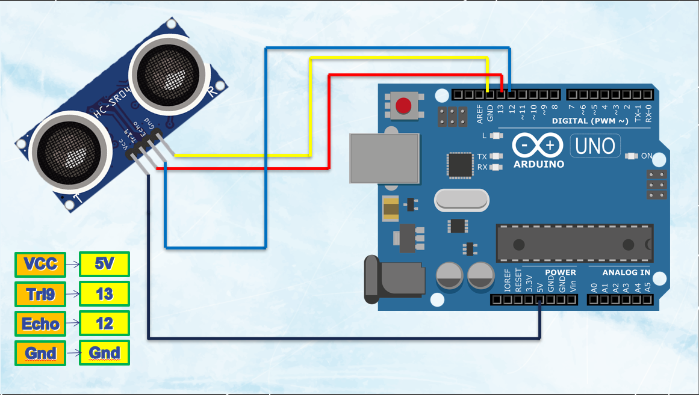
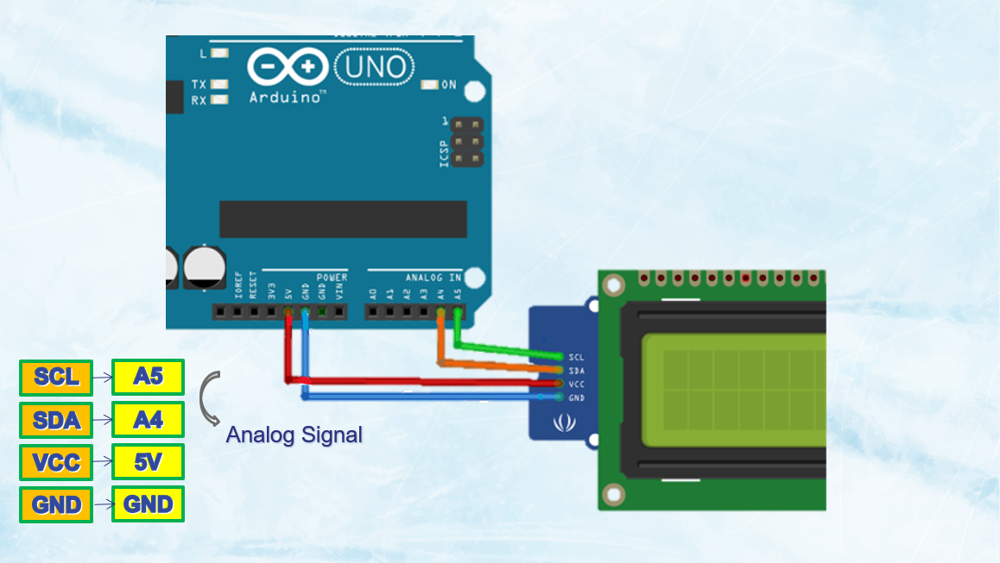

# Pacer System

**A Preliminary Study on the Application of Low-Cost Microcontrollers for Aerobic Endurance Assessment: Development and Field Testing of a PACER System**

[](https://opensource.org/licenses/MIT)
[](https://www.arduino.cc/)

## 📋 Table of Contents

- [Overview](#-overview)
- [Features](#-features)
- [Hardware Requirements](#-hardware-requirements)
- [Installation](#-installation)
- [Usage](#-usage)
- [Project Structure](#-project-structure)
- [Contributing](#-contributing)
- [License](#-license)
- [Acknowledgments](#-acknowledgments)

## 🎯 Overview

The Pacer System is an innovative Arduino-based fitness assessment tool designed to evaluate aerobic endurance using low-cost microcontrollers. This system implements a digital version of the Progressive Aerobic Cardiovascular Endurance Run (PACER) test, providing real-time feedback and automated scoring for fitness assessments.

<p align="center">
  
</p>

<p align="center">
  *Complete project overview and system architecture*
</p>

The system uses ultrasonic sensors to detect participant movement, an LCD display for real-time feedback, and audio cues to guide the testing process. It's designed for educational institutions, fitness centers, and research applications where cost-effective fitness assessment tools are needed.

## ✨ Features

- **Automated PACER Test Implementation**: Digital version of the standard PACER fitness test
- **Real-time Distance Detection**: Ultrasonic sensor-based movement tracking
- **Progressive Difficulty**: 7 rounds with increasing pace requirements
- **Visual Feedback**: 16x2 LCD display showing round, count, and failure information
- **Audio Cues**: Buzzer notifications for timing and feedback
- **Automatic Scoring**: Real-time calculation of test results
- **Failure Detection**: Automatic detection of missed intervals (max 2 failures)
- **Reset Functionality**: Easy system restart via button press
- **Low-cost Implementation**: Uses readily available Arduino components

## 🔧 Hardware Requirements

### Core Components

#### Complete Materials Overview

*Complete set of components needed for the Pacer System*

### 🔌 Wiring Diagram & Connection Guide

#### Step-by-Step Wiring Instructions

**Step 1: Arduino Microcontroller Setup**

- Use Arduino Uno or compatible microcontroller as the main processing unit
- Ensure the board is powered off during wiring

**Step 2: Ultrasonic Sensor Connections**

```
HC-SR04 Ultrasonic Sensor → Arduino Uno
├── VCC (Red)    → 5V
├── GND (Black)  → GND
├── Trig (Blue)  → Digital Pin 13
└── Echo (Green) → Digital Pin 12
```

**Step 3: LCD Display Connections**

```
16x2 I2C LCD Display → Arduino Uno
├── VCC (Red)   → 5V
├── GND (Black) → GND
├── SDA (Blue)  → A4 (Analog Pin 4)
└── SCL (Yellow)→ A5 (Analog Pin 5)
```

**Step 4: Additional Components**
```
Push Button → Arduino Uno
├── Terminal 1 → Digital Pin 2
└── Terminal 2 → GND (with internal pull-up resistor)

Buzzer → Arduino Uno
├── Positive (+) → Digital Pin 8
└── Negative (-) → GND
```

#### Connection Verification Checklist
- [ ] All power connections (VCC to 5V, GND to GND)
- [ ] Ultrasonic sensor trigger and echo pins
- [ ] I2C LCD SDA and SCL connections
- [ ] Button with proper pull-up configuration
- [ ] Buzzer polarity (+ to Pin 8, - to GND)
- [ ] No loose connections or short circuits

## 🚀 Installation

### Prerequisites
- Arduino IDE (version 1.8.0 or higher)
- Required Libraries:
  - `Wire.h` (included with Arduino IDE)
  - `LiquidCrystal_I2C.h`

### Library Installation
1. Open Arduino IDE
2. Go to **Sketch** → **Include Library** → **Manage Libraries**
3. Search for "LiquidCrystal I2C" by Frank de Brabander
4. Click **Install**

### Hardware Setup

> 💡 **Tip**: Refer to the [Wiring Diagram & Connection Guide](#-wiring-diagram--connection-guide) section above for detailed visual instructions.

### Software Installation
1. Clone this repository:
   ```bash
   git clone https://github.com/Vincentaun/Pacer_System.git
   ```

2. Open `Code_for_machine.ino` in Arduino IDE

3. Select your Arduino board and port:
   - **Tools** → **Board** → Select your Arduino model
   - **Tools** → **Port** → Select the appropriate COM port

4. Upload the code to your Arduino

## 📖 Usage

### Starting the Test
1. Power on the Arduino system
2. The LCD will display a 5-second countdown with visual effects
3. Position the participant at the starting line (within 150cm of the sensor)
4. Press and hold the button to begin the test

### During the Test
- The system runs through 7 progressive rounds
- Each round has specific timing requirements:
  - Round 1: 7 intervals, 9-second timing
  - Round 2: 8 intervals, 8.5-second timing
  - Round 3: 8 intervals, 8-second timing
  - Round 4: 9 intervals, 7.5-second timing
  - Round 5: 9 intervals, 7-second timing
  - Round 6: 10 intervals, 6.5-second timing
  - Round 7: 10 intervals, 6-second timing

### Test Completion
- **Success**: Complete all rounds successfully
- **Failure**: Miss 2 intervals (automatic termination)
- **Reset**: Press the button when prompted to restart

### Display Information
- **Round**: Current test round (1-7)
- **Count**: Successful intervals completed
- **Fail**: Number of failed intervals (max 2)
- **Result**: Final score upon completion

### Timing System
- Each round has progressively shorter intervals
- Ultrasonic sensor detects participant position
- Audio feedback confirms successful intervals
- Visual display shows real-time progress

## 📁 Project Structure

```
Pacer_System/
├── Code_for_machine.ino          # Main Arduino code
├── README.md                     # Project documentation
├── LICENSE                       # MIT License
├── 實驗記錄表 - Experiment Data.xlsx # Experimental data
└── assets/                       # Project assets
    ├── Arduino_MC.png           # Arduino microcontroller image
    ├── LCD_Display.png          # LCD display image
    ├── Materials.png            # Materials overview
    ├── Ultrasonic_Sensor.png    # Ultrasonic sensor image
    ├── poster.png               # Project poster
    └── 7864bdfb-91c2-44d7-b179-7c227cd5bad3.mp4 # Demo video
```

### Additional Media
- **Demo Video**: `7864bdfb-91c2-44d7-b179-7c227cd5bad3.mp4` - System operation demonstration

## 🤝 Contributing

We welcome contributions to improve the Pacer System! Here's how you can help:

### How to Contribute
1. **Fork** the repository
2. **Create** a feature branch:
   ```bash
   git checkout -b feature/amazing-feature
   ```
3. **Commit** your changes:
   ```bash
   git commit -m 'Add some amazing feature'
   ```
4. **Push** to the branch:
   ```bash
   git push origin feature/amazing-feature
   ```
5. **Open** a Pull Request

### Contribution Guidelines
- Follow Arduino coding standards
- Add comments for complex logic
- Test thoroughly with hardware
- Update documentation as needed
- Include hardware setup photos if adding new components

### Areas for Improvement
- [ ] Wireless connectivity (WiFi/Bluetooth)
- [ ] Data logging to SD card
- [ ] Mobile app integration
- [ ] Additional sensor support
- [ ] Calibration features
- [ ] Multi-participant support

## 📄 License

This project is licensed under the MIT License - see the [LICENSE](LICENSE) file for details.

```
MIT License

Copyright (c) 2025 Vincentaun

Permission is hereby granted, free of charge, to any person obtaining a copy
of this software and associated documentation files (the "Software"), to deal
in the Software without restriction, including without limitation the rights
to use, copy, modify, merge, publish, distribute, sublicense, and/or sell
copies of the Software, and to permit persons to whom the Software is
furnished to do so, subject to the following conditions:

The above copyright notice and this permission notice shall be included in all
copies or substantial portions of the Software.

THE SOFTWARE IS PROVIDED "AS IS", WITHOUT WARRANTY OF ANY KIND, EXPRESS OR
IMPLIED, INCLUDING BUT NOT LIMITED TO THE WARRANTIES OF MERCHANTABILITY,
FITNESS FOR A PARTICULAR PURPOSE AND NONINFRINGEMENT. IN NO EVENT SHALL THE
AUTHORS OR COPYRIGHT HOLDERS BE LIABLE FOR ANY CLAIM, DAMAGES OR OTHER
LIABILITY, WHETHER IN AN ACTION OF CONTRACT, TORT OR OTHERWISE, ARISING FROM,
OUT OF OR IN CONNECTION WITH THE SOFTWARE OR THE USE OR OTHER DEALINGS IN THE
SOFTWARE.
```

## 🙏 Acknowledgments

- **Arduino Community** - For the excellent development platform and libraries
- **LiquidCrystal_I2C Library** - By Frank de Brabander for LCD control
- **Educational Institutions** - For providing testing environments and feedback
- **Open Source Community** - For inspiration and collaborative development

---

**📧 Contact**: For questions, suggestions, or collaboration opportunities, please open an issue on GitHub.

**🔗 Links**: 
- [Arduino Official Website](https://www.arduino.cc/)
- [PACER Test Information](https://www.cooperinstitute.org/fitnessgram)
- [Project Repository](https://github.com/Vincentaun/Pacer_System)
